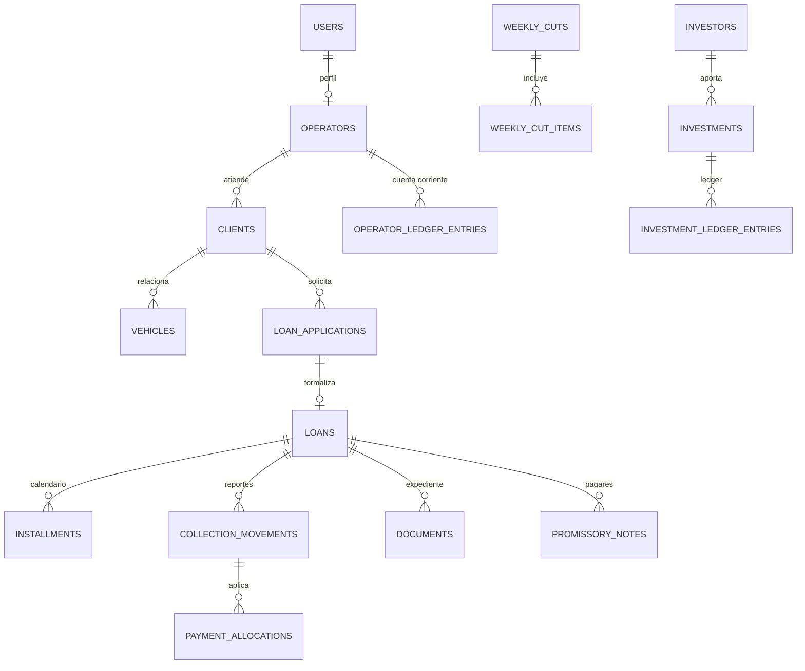

# Arquitectura

## Stack

- Laravel 13.8 con PHP 8.4+.
- Blade + Livewire 4 + Alpine.js como capa interactiva progresiva.
- Tailwind CSS 4 y Vite para assets.
- MySQL 8 / MariaDB compatible en produccion.
- Cola `database` para correo, PDF, Excel, importaciones y reportes pesados.

## Separacion de responsabilidades

- Calculos financieros: servicios en `app/Domain`, nunca en vistas, JS ni componentes.
- Autorizacion: roles/permisos con Spatie y Policies por recurso en las siguientes fases.
- Transacciones: formalizacion de prestamos, confirmacion de cortes, liquidaciones, anulaciones y ledgers.
- Auditoria: `audit_events` como bitacora append-only de acciones sensibles.
- Documentos: disco privado y descarga por controlador autorizado.

## Diagrama de dominio inicial

## Fases

1. Base tecnica, autenticacion, usuarios y layout.
2. Operadores, clientes, vehiculos, simulador, solicitudes, prestamos y calendario.
3. Cobranza, cortes, confirmacion y cuenta corriente.
4. Expedientes, pagares, adelantos y liquidaciones.
5. Inversionistas y reportes.
6. Importacion historica, hardening y produccion.
